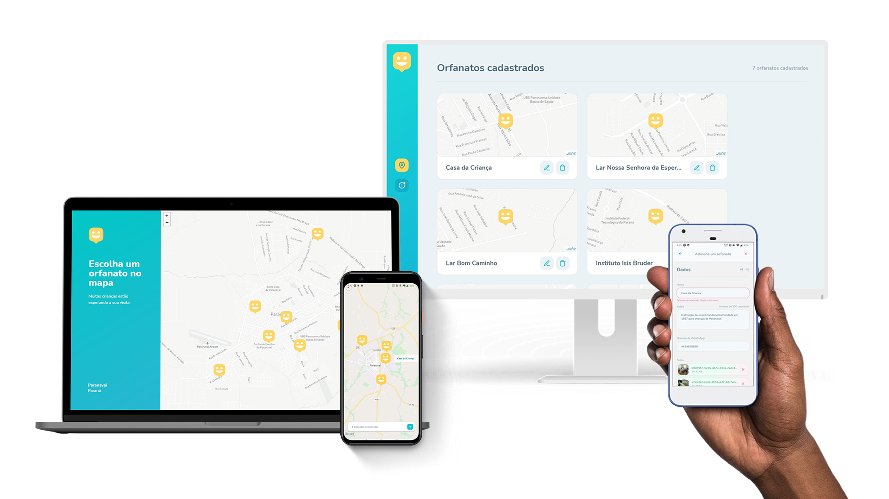

<h1 align="center">
    
</h1>

<p align="center">
  <a href="#computer-projeto">Projeto</a>&nbsp;&nbsp;&nbsp;|&nbsp;&nbsp;&nbsp;
  <a href="#rocket-stack">Tecnologias</a>&nbsp;&nbsp;&nbsp;|&nbsp;&nbsp;&nbsp;
  <a href="#wrench-setup">Instalação e configuração</a>&nbsp;&nbsp;&nbsp;|&nbsp;&nbsp;&nbsp;
  <a href="#exclamation-progresso">Progresso (updates & issues)</a>&nbsp;&nbsp;&nbsp;|&nbsp;&nbsp;&nbsp;
  <a href="#memo-licença">Licença</a>
</p>

<p align="center">
  
  
  
  
</p>

<br>

<p align="center">
  
</p>

## :computer: Projeto

O Happy é uma aplicação que conecta pessoas à casas de acolhimento institucional para fazer o dia de muitas crianças mais feliz. A proposta do projeto foi envisionada e criada pelo time [Rocketseat](https://rocketseat.com.br/); a aplicação teve suas funcionalidades e requisitos iniciais implementados durante o período de uma semana no evento online [Next Level Week](https://nextlevelweek.com/) #3 promovido pela empresa.

## :rocket: Stack

<p align="left">
    
    
    
    
      
</p>

  

## :wrench: Setup

O projeto consiste em um monorepo reunindo a [API](/packages/api) (rotas e banco de dados), [cliente web](/packages/web) (front-end com React + NextJS) e [mobile](/packages/mobile) (React Native usando Expo). Para replicar e rodar o projeto em sua máquina local:


```bash
# Clone o repositório
git clone https://github.com/aadelgrossi/nlw3-happy.git

# Rode o script de setup para instalar as dependências e renomear os arquivos .env.example
# Obs.: no Windows, é necessário rodar `yarn` com privilégios de administrador para que o comando *postinstall* complete com sucesso.
yarn setup
```

### Configure as variáveis de ambiente para cada projeto que deseje rodar localmente:

**./packages/api/.env**  

Popule os dados da sua instância Postgres e um banco de dados vazio (por padrão *nlw3-happy*, caso deseje renomear para outro altere em TYPEORM_DATABASE).

Endereço, porta, login, senha e nome do banco
```bash
TYPEORM_HOST=
TYPEORM_PORT=5432
TYPEORM_USERNAME=postgres
TYPEORM_PASSWORD=postgres
TYPEORM_DATABASE=nlw3-happy
```

**./packages/web/.env**  
Necessário token para acesso a API do MapBox. Crie uma conta em https://account.mapbox.com/auth/signup/, gere o token de acesso e insira na variável de ambiente. 
```bash
NEXT_PUBLIC_MAP_BOX_TOKEN=
```

**./packages/mobile/.env**  
Não necessita de configuração adicional.

Rode as migrations e faça o seed inicial do banco com dados (usuário admin e 5 orfanatos)
```bash
yarn db:setup
```

Inicialize o servidor e API:
```bash
yarn run:api
```

Inicialize o cliente web em http://localhost:3000
```bash
yarn run:web
```

Inicializa o cliente Expo (rode em emulador Android/iOS ou use o QR Code para rodar em dispositivo físico)
```bash
yarn run:mobile
```

## :exclamation: Progresso

O projeto segue sob atualização para a versão 2.0 com o objetivo de atingir as especificações e novas funcionalidades descritas no documento [Desafio 2.0](https://www.notion.so/Vers-o-2-0-do-Happy-c754db7a4d41469e8c2d00fcf75392c4), fornecido pela equipe da Rocketseat como uma forma de levar a aplicação ao próximo nível. 

As features e issues remanescentes para implementação e bugs para correção encontram-se listadas e catalogadas na aba [Issues](https://github.com/aadelgrossi/nlw3-happy/issues) deste repositório e o projeto encontra-se aberto para contribuições e melhorias (comentários, sugestões de fixes ou refatorações e pull requests são mais que bem-vindos :smile: )

## :memo: Licença

Esse projeto está sob a licença [MIT](https://github.com/aadelgrossi/nlw3-happy/blob/master/LICENSE)
