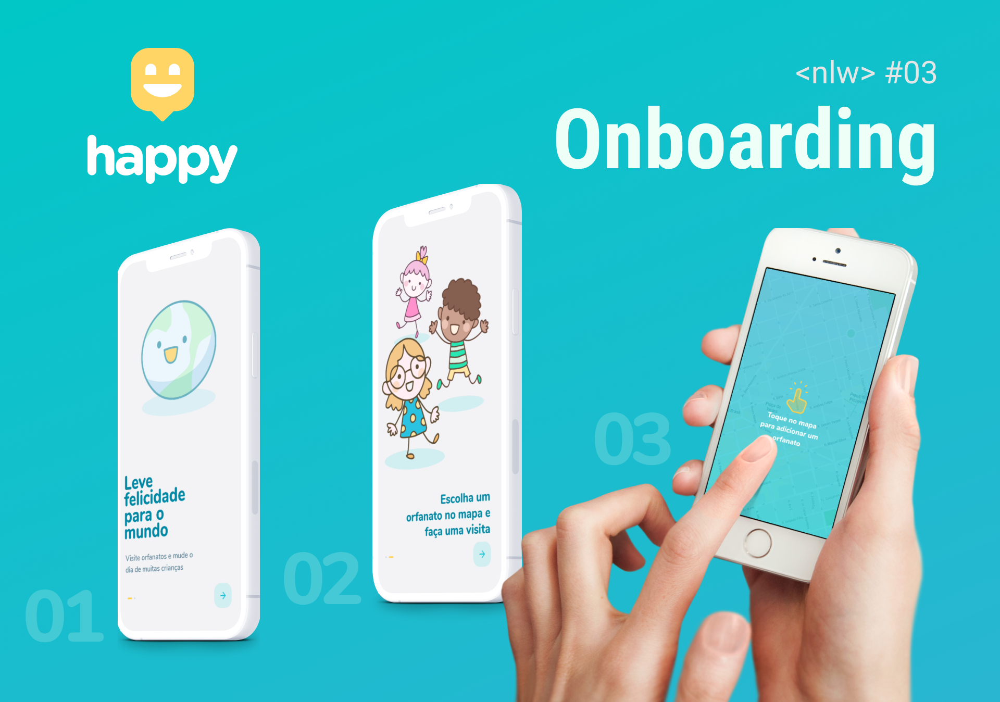
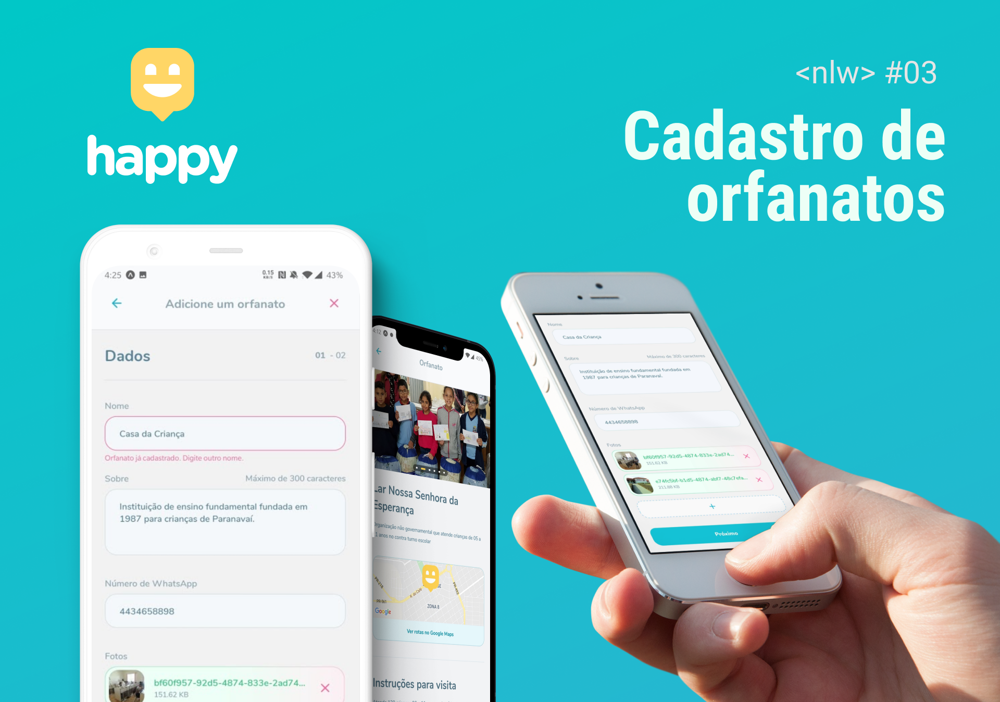

# @nlw3-happy/mobile

Cliente mobile do projeto Happy, desenvolvido para atender os novos requisitos do [Desafio 2.0](https://www.notion.so/Vers-o-2-0-do-Happy-c754db7a4d41469e8c2d00fcf75392c4) proposto ao final do evento Next Level Week #3.  


## Novas páginas de onboarding
Adicionado um slider com instruções e ilustrações na primeira inicialização do app.

<p align="center">
  
</p>

## Fluxo de cadastro de orfanatos

Cadastro dividido em duas etapas com validações para todos os campos necessários utilizando as biblioteca react-hook-form e yup.  
Como requisito extra não proposto pelo desafio porém implementado nesta versão, é realizada durante o cadastro a validação assíncrona do campo nome assegurando que não sejam cadastrados orfanatos duplicados.

<p align="center">
  
</p>


## :wrench: Configuração

Renomeie o arquivo .env.example para .env
```bash
mv .env.example .env
```

Configure as variáveis de ambiente:
```bash

# URL do serviço da API
API_URL=http://localhost:3333
```

## :rocket: Inicie o servidor expo

```
yarn start
```
