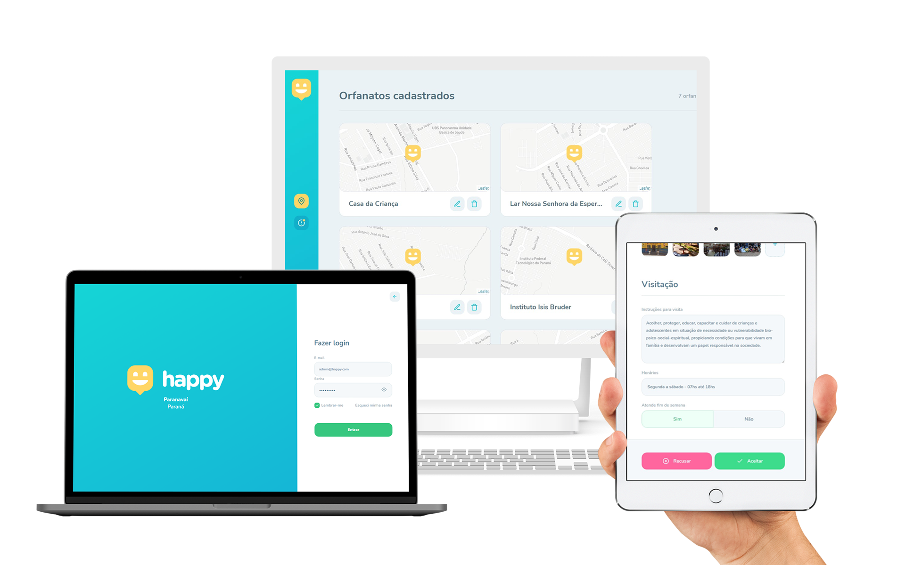

# @nlw3-happy/web

<p align="center">
  
</p>

Cliente web do projeto Happy.
[Live demo](https://happy.andregrossi.com)

## :wrench: Configuração

Renomeie o arquivo .env.example para .env
```bash
mv .env.example .env
```

Configure as variáveis de ambiente:
```bash
# URL do servidor NextJS local
NEXT_PUBLIC_APP_URL=http://localhost:3000

# URL do serviço da API
NEXT_PUBLIC_API_URL=http://localhost:3333

# Token de acesso ao MapBox. Crie uma conta https://account.mapbox.com/auth/signup/, obtenha um token de acesso e inclua nesta variável.
NEXT_PUBLIC_MAP_BOX_TOKEN=
```

## :rocket: Inicie o servidor

```
yarn start
```
